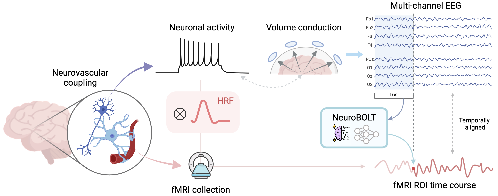

# NeuroBOLT⚡

This repo contains the code of our NeurIPS 2024 paper: 
**"NeuroBOLT: Resting-state EEG-to-fMRI Synthesis with Multi-dimensional Feature Mapping"**
Yamin Li, Ange Lou, Ziyuan Xu, Shengchao Zhang, Shiyu Wang, Dario J. Englot, Soheil Kolouri, Daniel Moyer, Roza G. Bayrak, Catie Chang
Vanderbilt University

-[📄 Paper](https://arxiv.org/abs/2410.05341) - [🖼️ Project Page](https://soupeeli.github.io/NeuroBOLT/) - [🪧Poster](https://neurips.cc/media/PosterPDFs/NeurIPS%202024/93044.png?t=1733617950.057914)





## Setup
Create environment and install required packages:
   ```bash
   conda create -n neurobolt python=3.9
   conda activate labram
   conda install pytorch==2.0.0 torchvision==0.15.0 torchaudio==2.0.0 pytorch-cuda=11.8 -c pytorch -c nvidia
   conda install tensorboardX
   pip install -r requirements.txt
   ```
   
## Dataset & Checkpoints
Organize your dataset and pretrained weights as follows
```
NeuroBOLT/
├── checkpoints/          # Store model weights here
├── data/
│   ├── EEG/              # Store EEG dataset (EEGLAB format) files
│   ├── fMRI_difumo/      # Store fMRI ROI time series files
│   ├── fMRI/             # Store fMRI data (.nii file)
│   ├── motions/          # Store fMRI motion parameters or other confounds
```
The `data` folder can be stored in any location of your choice. If it's not placed within the code directory, simply update the dataset_root configuration in `main.py` to reflect the correct path.

## Run Experiments
### Prepare Data
**EEG:** The current scripts require preprocessed EEG data in EEGLAB `.set` format as input.  If needed, you may write your own preprocessing code to prepare the data accordingly. Notably, if you want to train the model, the EEG `.set` file should include event markers for synchronization with fMRI data collection. 

**fMRI:** Prepare your fMRI data using `making_difumo.py`. This script convert fMRI `.nii` file into ROI time series using [DiFuMo](https://github.com/Parietal-INRIA/DiFuMo) atlas. You can modify the script as needed to adapt it to your specific fMRI dataset. You can also use a different brain atlas by creating a custom script for ROI extraction, as long as the output format remains consistent.

**Configure the model for your dataset:**
   - Update the default configurations in `main.py` under # ---- Dataset specific info ---- to match your dataset, or specify them when running the command.
   - Define your dataset loader with the appropriate channel names in `def get_dataset(args)` in `main.py`.
   - If needed, you can create a new dataloader in `get_datasets.py ` to properly handle your dataset format。
   - If you would like to do **cross-subject training**, use the example `scan_split_example.xlsx` file to define the train/val/test split of all scans. Ensure that if a subject has multiple scans, all scans from the same subject should belong to the same set.
  

### Run training
Run `main.py` for training, e.g., to predict `Thalamus` fMRI activity:
   - **Intra-subject/scan prediction**
      ```bash
      python main.py --batch_size 16 --finetune ./checkpoints/labram-base.pth --labels_roi Thalamus --dataset VU --train_test_mode intrascan --dataname sub11-scan01
      ```
   - **Cross-subject prediction**
      ```bash
      python main.py --batch_size 64 --finetune ./checkpoints/labram-base.pth --labels_roi Thalamus --dataset VU --train_test_mode full_test --split_index_sheet ./scan_split_example.xlsx
      ```
   
## TODO List
- [x]  Release code.
- [ ]  Upload inference demo
- [ ]  Release pretrained checkpoints.


## Reference
```bibtex
@inproceedings{
li2024neurobolt,
title={Neuro{BOLT}: Resting-state {EEG}-to-f{MRI} Synthesis with Multi-dimensional Feature Mapping},
author={Yamin Li and Ange Lou and Ziyuan Xu and Shengchao Zhang and Shiyu Wang and Dario J. Englot and Soheil Kolouri and Daniel Moyer and Roza G Bayrak and Catie Chang},
booktitle={The Thirty-eighth Annual Conference on Neural Information Processing Systems},
year={2024},
url={https://openreview.net/forum?id=y6qhVtFG77}
}

or

@article{li2024neurobolt,
  title={NeuroBOLT: Resting-state EEG-to-fMRI Synthesis with Multi-dimensional Feature Mapping},
  author={Li, Yamin and Lou, Ange and Xu, Ziyuan and Zhang, Shengchao and Wang, Shiyu and Englot, Dario J and Kolouri, Soheil and Moyer, Daniel and Bayrak, Roza G and Chang, Catie},
  journal={arXiv preprint arXiv:2410.05341},
  year={2024}
}
```

